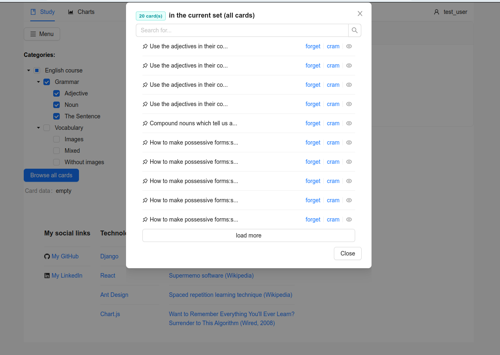
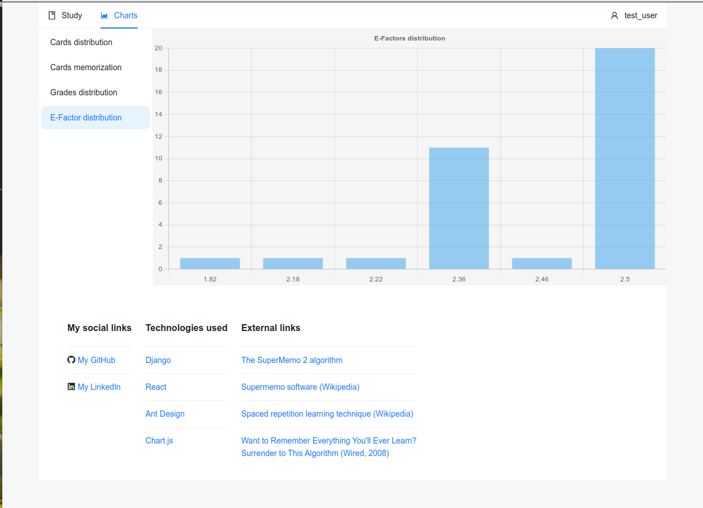
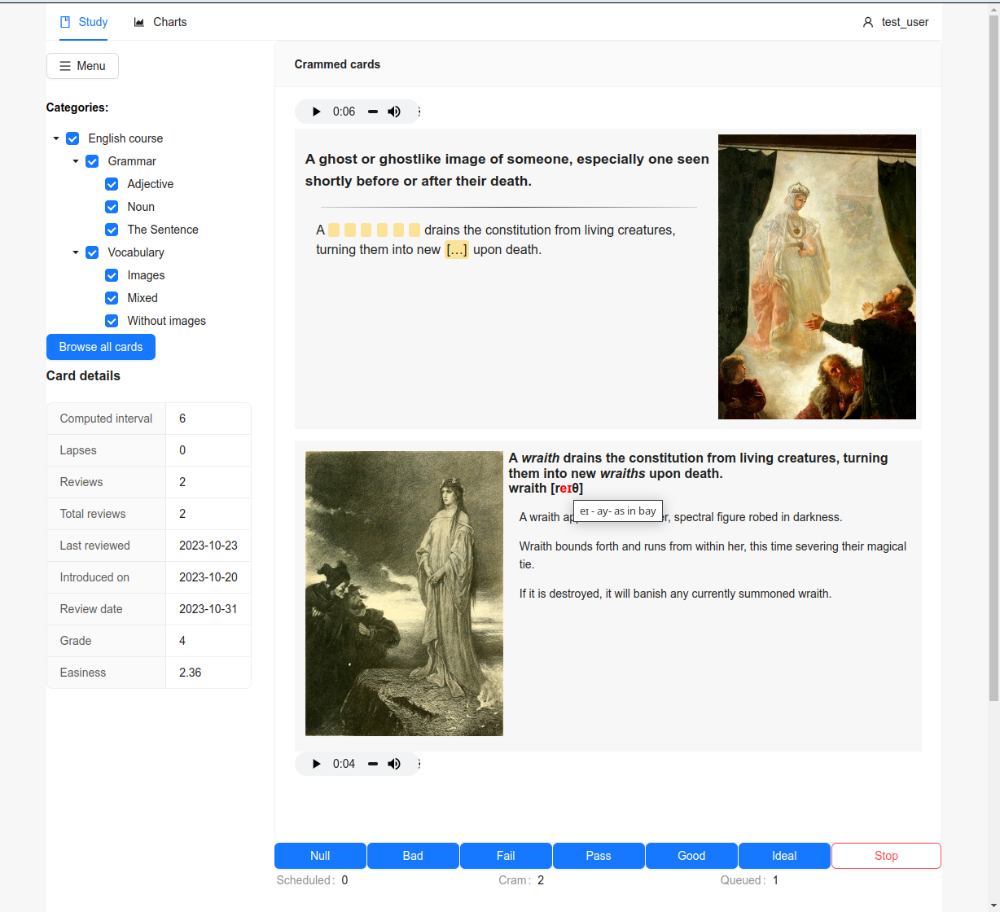

# This is a front-end application for spaced repetition app (similar in spirit to SuperMemo and Mnemosyne apps.)

### Installation:
* The application is intended for deployment on a web server (or
a PaaS service - Render, Heroku etc.).

#### Build:
* execute ```npm install``` command in the application directory to download the dependencies
* Then build the application with
```
$ npm run build
```
* The contents of the new directory (*build*) should be placed in
the following backend application directories:
   * index.html -> react_app/templates
   * static/* (directory contents) moved to react_app/static
   * after that - collect static files in one place:
   ```
   python manage.py collectstatic
   ```
* After completing these steps, you must rebuild the backend application container
(if we use Docker):
   ```
   docker-compose -f docker-compose-dev.yml up --build
   ```
### Usage
The application optimizes learning by optimally determining the intervals in which
knowledge (in the form of *cards* with tasks/exercises - questions and answers)
are shown to the user and rated by him/her.

#### Learning new material
The easiest way to start learning previously prepared cards is to choose
*Learn new cards* button from the main screen.
Cards should be added to the learning mode by grading them -
the higher the grade, the less often we will see a given card. The cards we graded below
*Pass* will also be added to the *Cram* queue.

#### The *Cram* queue
Cards that receive ratings below *Pass* are placed (as described above) in the *Cram* queue.
The Cram is used to review and memorize the cards which
we had a problem with during review session,
or for some other reason we want to review them additionally. Grading
cards in the *Cram* does not affect the easiness factor (*E-Factor* - used for
calculating intervals between reviews) and the number of repetitions recorded by
the application for a given card.

#### Reviewing scheduled cards
Repeating cards from this queue causes calculating and recording new intervals (counted in days),
after which the cards will be shown to the user again. Grade buttons are used to determine intervals
and provide the application with feedback on how well the user has memorized the content
material on the cards. Please keep in mind that:
* Null, Bad, Fail grades mean that the material has been forgotten
(the given answer was wrong) and the user should
start repeating the card from the beginning: *Null* - the card will be shown more often;
*Fail* - less often
* Pass, Good, Ideal grades - the card has been remembered (the answer given was
correct):
   * *Pass* - there was a problem with remembering the card, the interval
was too long
   * *Good* - the interval was right
   * *Ideal* - the interval could be longer

### Card editing
Cards can currently only be added using the web framework admin panel
(and this is a feature only available to the administrator). The next stage will be
writing a script to import cards and media from the other applications, and later
- a separate panel for managing (authoring) cards (adding, editing
cards, multimedia files, etc.).

### Screenshots:




